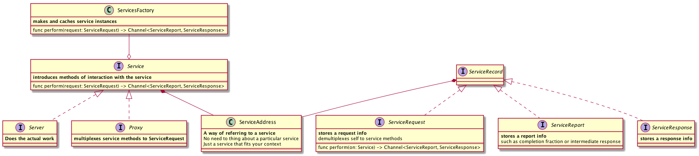

# Actor Model

This is a suggested implementation of [Actor Model](https://en.wikipedia.org/wiki/Actor_model).



## Terminology
- **`Service`** respons to a range of requests. There are several kinds of `Services`:

| kind of `Service` | function | must be obtainable synchronously | preferred semantic |
|-------------------|---------------------------------------------------|-----|-------------------------|
| `Server`          | does real work of providing responses on requests | NO  | reference type, `class` |
| `Client`          | delivers requests to remote server                | NO  | reference type, `class` |
| `Proxy`           | multiplex service methods to `ServiceRequest`     | YES | value type, `struct`    |

- **`ServicesFactory`** is a way of obtaining a service instance.

## Service Usage
```swift
let servicesFactory = /* obtain `ServicesFactory` */

// obtain service syncronously
let peopleService = servicesFactory.peopleService(environment: .production)

// use service asyncronously
peopleService.person(name: "John Appleseed").onSuccess {
	print("There is a person \($0)")
}
```

## How to run

1. clone
2. `cd <dir_of_cloned_repo>`
3. `swift package update`
